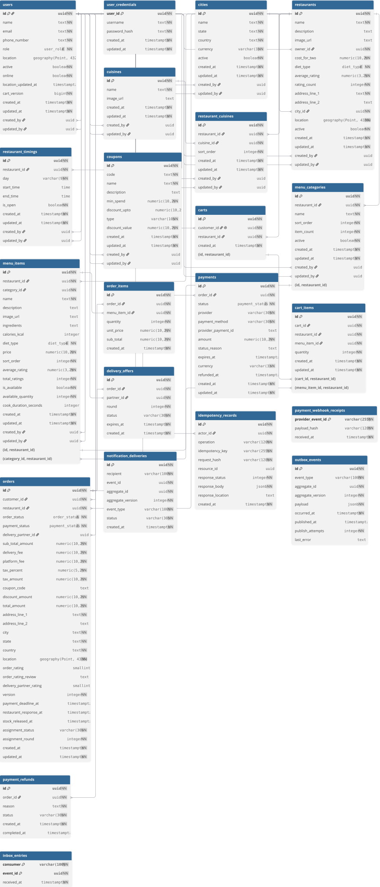

# Food Delivery Assignment — Evaluator Guide

This Spring Boot REST backend demonstrates food ordering, transactional stock reservation, concurrent delivery assignment, and asynchronous notifications. The sections below explain the assumptions, design, implementation, and concurrency solutions before the local setup and verification instructions.

## 1. Assumptions

- There are four roles: admin, restaurant owner, customer, and delivery partner. Accounts are provisioned or seeded for the demo; ownership is determined from the authenticated user.
- A customer has one cart containing items from one restaurant. Adding an item from another restaurant replaces the cart contents. Adding to a cart does not reserve stock; checkout reserves it.
- Each order belongs to one restaurant. Prices and quantities are captured in order items, and totals are calculated on the server using decimal arithmetic. The current checkout total is the sum of item prices multiplied by quantities; additional fees, taxes, and discounts are not calculated.
- One order can have one assigned partner, and one partner can have at most one active delivery. Active work includes `Accepted`, `Preparing`, `Ready for pickup`, and `Out for delivery` orders.
- Delivery offers use a first-valid-acceptance policy. Receiving an offer does not reserve the order or the partner. The nearest partner is not guaranteed to win.
- Payments and refunds are simulated. Pending payments have a 15-minute deadline in the current implementation; delivery offers expire after 60 seconds.
- The assignment runs as one application with PostgreSQL/PostGIS and RabbitMQ. Events may be delivered more than once, so consumers need duplicate protection; exactly-once console output is not assumed.

## 2. Design and current implementation

The application is organized by feature. Controllers expose resource-oriented REST APIs and request/response DTOs; services contain business operations and transaction boundaries; repositories contain persistence access. Admin is an authorization role rather than a separate persistence layer.

Hibernate/Spring Data JPA handles ordinary persistence and row locking. Feature repositories contain the spatial and PostgreSQL-specific queries. Flyway owns database migrations, and Hibernate validates the resulting schema. Database transactions protect shared stock and delivery assignments across concurrent requests.

Business events are recorded in a transactional outbox alongside database changes. A background publisher forwards pending events to RabbitMQ, and consumers use an inbox to guard against duplicate processing. Notification work runs asynchronously rather than delaying the originating API request.

The current code includes:

- JWT issuance, BCrypt credentials, authenticated APIs, role/ownership checks, and Swagger bearer authorization.
- City and cuisine lookup APIs, restaurant management and search, menu/category management, and partner location/availability APIs.
- Customer carts with cart versions, checkout idempotency, guarded stock reservation, order-item snapshots, and pending payment creation.
- Signed mock-payment webhook handling, payment expiry, stock release, and mock refunds.
- Restaurant order decisions and preparation/readiness transitions, delivery offers and acceptance, pickup/delivery transitions, and delivered-order reviews.
- Outbox publishing, inbox duplicate protection, asynchronous notification handling, demo seeding, and integration tests against real PostgreSQL/PostGIS and RabbitMQ.

Implementation boundaries matter when evaluating the original design: delivery offer creation currently selects active, online partners, but does not yet filter by distance, location freshness, or workload at discovery time. Workload is checked when accepting an offer. The planned automatic offer-expiry processing, assignment retry flow, and restaurant-response delay handling are not implemented. These are remaining design gaps, not intentional scope exclusions. Existing tests should not be read as proof that every planned workflow is complete.

## 3. Considered out of scope

- A customer-facing UI or mobile application; Swagger and the example HTTP requests are the assignment interface.
- Real payment-provider integration, real refunds, cash on delivery, coupons, and production fee/tax calculation.
- Self-service registration, password reset, refresh tokens, and individual-token logout/revocation.
- General customer cancellation, reassignment after pickup, route optimization, delivery ETA prediction, and nearest-first sequential dispatch.
- Microservices, cloud deployment, application containerization/CI pipelines, and production monitoring. A local RabbitMQ container is only supporting infrastructure.
- Real SMS, email, or push delivery and an exactly-once guarantee for external notification side effects.

## 4. Solutions to the three concurrency problems

### Problem 1: Multiple customers order the same limited stock

Reading stock and later writing a new value would allow concurrent requests to purchase the same units. Checkout instead reserves each line with a single guarded database update: decrement `available_quantity` only when the item belongs to the cart's restaurant, is available, and has enough quantity. The affected-row count must be one; otherwise checkout returns HTTP 409.

PostgreSQL serializes competing updates to the same item row and checks the stock condition against the updated value. Cart lines are processed in menu-item ID order to keep reservation ordering consistent. Reservation, order/items, pending payment, cart clearing, and the outbox entry share one transaction, so a failed line rolls back earlier reservations. A customer row lock and cart-version check also serialize checkout against that customer's cart mutations; an idempotency key protects checkout retries.

Implementation: [CheckoutService](src/main/java/com/rk/fooddelivery/order/service/CheckoutService.java) and [MenuItemRepository.reserve](src/main/java/com/rk/fooddelivery/menu/repository/MenuItemRepository.java).

Expected result: with stock five and 20 customers each requesting one unit, five requests return 201, fifteen return 409, five orders exist, and stock is zero. This is asserted by `twentySimultaneousCheckoutsAgainstStockFiveCreateOnlyFiveOrders` in [CheckoutConcurrencyTest](src/test/java/com/rk/fooddelivery/order/CheckoutConcurrencyTest.java).

### Problem 2: Two delivery partners accept the same order

Acceptance validates the offer's partner, round, and expiry, then takes a pessimistic write lock on the partner row, checks that partner's workload, and locks the order row. Under the order lock it checks whether a partner is already assigned. Accepting the offer and assigning the order happen in the same transaction.

Different partners can lock their own rows concurrently, but only one can hold the shared order lock. After the winner commits, the second request sees the assignment and returns HTTP 409. The first successful transaction determines the winner.

Implementation: [DeliveryOfferService.acceptOffer](src/main/java/com/rk/fooddelivery/delivery/service/DeliveryOfferService.java) and [OrderRepository](src/main/java/com/rk/fooddelivery/order/repository/OrderRepository.java).

Expected result: one HTTP 200, one HTTP 409, one assigned partner, and one accepted offer. This is asserted by `simultaneousAcceptancesForOneOrderLeaveExactlyOneAssignedPartner` in [DeliveryAssignmentConcurrencyTest](src/test/java/com/rk/fooddelivery/delivery/DeliveryAssignmentConcurrencyTest.java).

### Problem 3: One delivery partner accepts two different orders

Locking only the orders would not protect this case because the requests target different rows. Both acceptance requests therefore lock the same partner row before checking active work. The second request waits for the first transaction to finish, then its workload query sees the newly assigned active order and rejects the second assignment with HTTP 409.

The partner lock, workload check, order lock, and assignment all remain inside the acceptance transaction. This enforces the single-active-delivery rule through the application's acceptance path without relying on an in-memory lock.

Implementation: [DeliveryOfferService.acceptOffer](src/main/java/com/rk/fooddelivery/delivery/service/DeliveryOfferService.java), [UserRepository](src/main/java/com/rk/fooddelivery/user/repository/UserRepository.java), and [PartnerWorkloadRepository](src/main/java/com/rk/fooddelivery/delivery/repository/PartnerWorkloadRepository.java).

Expected result: one HTTP 200 and one HTTP 409; the partner has exactly one active order and the other order remains unassigned. This is asserted by `simultaneousAcceptancesForTwoOrdersLeavePartnerAssignedToOnlyOne` in [DeliveryAssignmentConcurrencyTest](src/test/java/com/rk/fooddelivery/delivery/DeliveryAssignmentConcurrencyTest.java).

## 5. Schema design



The schema separates users/credentials, the restaurant catalog, carts, orders and their item snapshots, payments, delivery offers, reviews, and event-delivery records. Foreign keys preserve relationships; cart/item restaurant constraints prevent mixing items from different restaurants.

The [Flyway migrations](src/main/resources/db/migration) are the authoritative schema definition. The [editable DBML diagram](docs/diagrams/food-delivery-schema.dbml) and [database notes](docs/database.md) provide further detail.

## 6. Set up and run locally

### Fill in `.env`

Copy the example if you do not already have a local `.env` file:

```bash
cp .env.example .env
```

Fill in every setting using `.env.example` as the template:

- `DB_URL`, `DB_USERNAME`, `DB_PASSWORD`: your PostgreSQL/PostGIS database connection.
- `JWT_SECRET`: a Base64-encoded secret containing at least 32 random bytes. Generate a value with `openssl rand -base64 32` and paste it into `.env`.
- `RABBITMQ_HOST`, `RABBITMQ_PORT`, `RABBITMQ_USERNAME`, `RABBITMQ_PASSWORD`, `RABBITMQ_VHOST`: your RabbitMQ connection.

You need Java 25, a running PostgreSQL database with PostGIS available, and RabbitMQ. Set `JAVA_HOME` to your Java 25 installation. Flyway applies the database migrations on startup.

For the supplied local setup, `rk-assignment-rabbit` exposes AMQP on `localhost:5673`; its management UI is at [http://localhost:15673](http://localhost:15673), with local credentials `guest` / `guest`. Change the example values to match your machine. Keep `.env` private; Git ignores it.

### Run the application

If your VS Code launch configuration loads `.env`, run using that configuration. For a terminal launch, export the file's values first—the application does not automatically read `.env`:

```bash
set -a
source .env
set +a
./mvnw spring-boot:run
```

The application starts on port 8080. Keep the same JWT secret across restarts to preserve the validity of unexpired tokens.

### Open Swagger

- [Swagger UI](http://localhost:8080/swagger-ui/index.html)
- [OpenAPI JSON](http://localhost:8080/v3/api-docs)

After loading the sample accounts in the next step, call `POST /api/auth/tokens` with a demo username and password. Copy the returned `accessToken`, click **Authorize** in Swagger, and paste the raw token into `bearerAuth`. Protected APIs require this token; it expires after two days (172,800 seconds).

## 7. Load lookup and sample data

Stop the running application, then start it with the `demo` profile in the same configured terminal:

```bash
./mvnw spring-boot:run -Dspring-boot.run.profiles=demo
```

This starts the application and loads cities, cuisines, restaurants, menu categories, menu items, and demo accounts into the database specified by `DB_URL`. It is not a separate seed-only command. Existing seeded records are retained on subsequent runs.

All demo accounts use the password `DemoPass!2026`:

| Role             | Example username       |
| ---------------- | ---------------------- |
| Admin            | `admin@demo.local`     |
| Restaurant owner | `owner1@demo.local`    |
| Customer         | `customer1@demo.local` |
| Delivery partner | `partner1@demo.local`  |

Example request body for `POST /api/auth/tokens`:

```json
{ "username": "customer1@demo.local", "password": "DemoPass!2026" }
```

## 8. Run tests

The required concurrency checks are:

| Scenario                                                | Expected result                                                                         | Current automated coverage                                                                           |
| ------------------------------------------------------- | --------------------------------------------------------------------------------------- | ---------------------------------------------------------------------------------------------------- |
| Multiple customers check out the same limited stock     | With 20 simultaneous checkouts and stock 5: exactly 5 orders, 15 conflicts, and stock 0 | `CheckoutConcurrencyTest.twentySimultaneousCheckoutsAgainstStockFiveCreateOnlyFiveOrders`            |
| Two partners accept the same order simultaneously       | Exactly one assignment succeeds; the other request receives a conflict                  | `DeliveryAssignmentConcurrencyTest.simultaneousAcceptancesForOneOrderLeaveExactlyOneAssignedPartner` |
| One partner accepts two different orders simultaneously | Only one order is assigned to that partner; the other remains unassigned                | `DeliveryAssignmentConcurrencyTest.simultaneousAcceptancesForTwoOrdersLeavePartnerAssignedToOnlyOne` |

Each test uses independent HTTP requests on concurrent threads, synchronized by a start barrier, against the real PostgreSQL/PostGIS database and RabbitMQ-backed Spring application.

Tests require the dedicated `fooddelivery_assignment_test` PostgreSQL/PostGIS database and RabbitMQ vhost. They clear test data; do not point them at your application database. Create the test database with your PostgreSQL tooling and ensure its user can run the PostGIS migrations.

For the local RabbitMQ container, create the test vhost once if it does not exist:

```bash
docker exec rk-assignment-rabbit rabbitmqctl add_vhost fooddelivery_assignment_test
docker exec rk-assignment-rabbit rabbitmqctl set_permissions -p fooddelivery_assignment_test guest '.*' '.*' '.*'
```

In a separate terminal, set Java 25 and the dedicated test connection values. Replace the database username and password below with your local credentials:

```bash
export TEST_DB_URL=jdbc:postgresql://localhost:5432/fooddelivery_assignment_test
export TEST_DB_USERNAME=abcom
export TEST_DB_PASSWORD=''
export RABBITMQ_HOST=localhost
export RABBITMQ_PORT=5673
export RABBITMQ_USERNAME=guest
export RABBITMQ_PASSWORD=guest
export RABBITMQ_VHOST=fooddelivery_assignment_test

# Run all three concurrency scenarios
./mvnw -Dtest=CheckoutConcurrencyTest,DeliveryAssignmentConcurrencyTest test
```

Run the full existing test lifecycle and formatting checks with:

```bash
./mvnw verify
```

Run test commands sequentially because they share the dedicated database and vhost.
